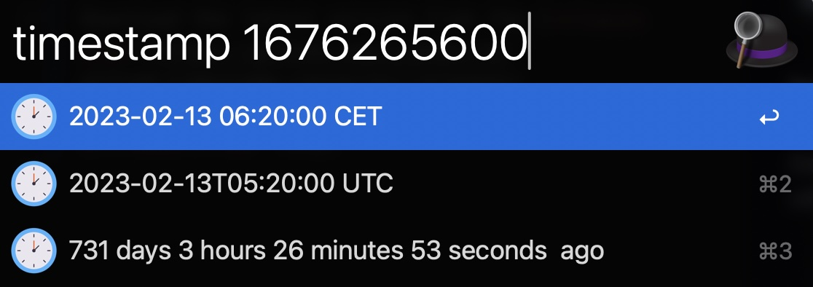

# alfred-timestamp-converter

Alfred workflow to convert a timestamp in human readable format and how much time ago it was.

Use it by typing `timestamp <VALUE>` in Alfred.

Time is displayed in the local timezone and UTC.

Alternatively, you can select and highlight a timestamp in any application and use the hotkey `Option + t` to convert it.

If you type `Intro` while highlighting a converted string, it will be copied to the clipboard.

## Installation

Download the latest version from the [releases page](https://github.com/juanborre/alfred-timestamp-converter/releases)
and double click the `Timestamp.converter.alfredworkflow` file.
